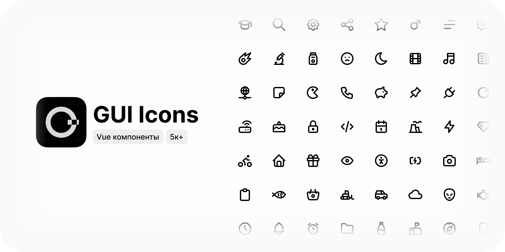

# @gui/icons



Библиотека иконок в формате Vue компонентов. Используется в [@gui](https://github.com/kirillgalushko/gui).

## Разработка

Новые иконки размещаются в папке `icons`.

### Сборка

Для запуска сборки Vue компонентов из `svg` используйте команду:

```bash
npm run build
```

### Релиз

Для релиза новой версии используйте команду:

```bash
npm run release
```

Выберите тип изменений `major/minor/patch`, версия автоматически обновится в `package.json`.